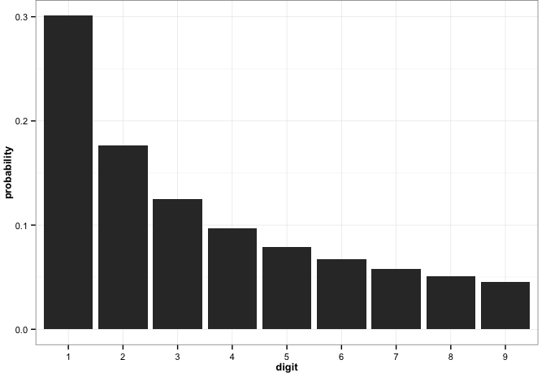

# Shiny Benford

This was created as a simple demonstration project, to show a group of forensic accountants the benefits to using statistical software more advanced than the Excel macros they had been working with.

Benford's Law posits that in any set of real-world numbers, the most significant digits are distributed according to .

 

Benford's Law is often used in forensic accounting. A common use, for example, would be to chart the distribution for a general ledger or petty cash account. In many cases, investigators have found bulges deviating from the Benford Distribution just under some officer's spending authority limit. 

The Shiny app may be viewed [here](https://amose.shinyapps.io/shinybenford).

For more information about the use of the Benford Distribution in fraud detection, and the rationale behind the transformations available in the app, see Nigrini, M. J. (2011). Forensic Analyticis: Methods and Techniques for Forensic Accounting Investigations.
